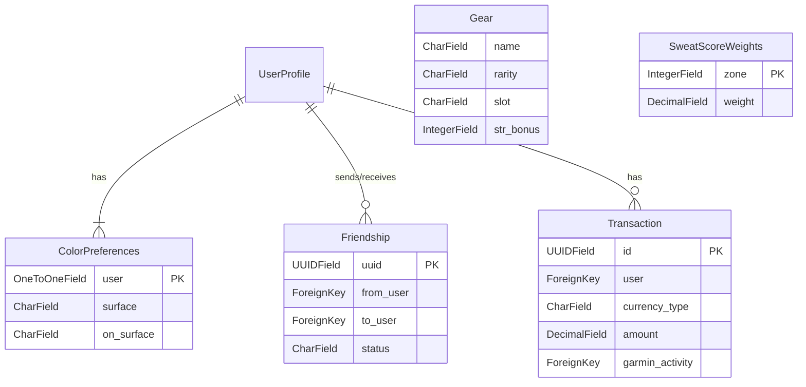

# Core Models Documentation

## Overview
The `Flexingg/core/models.py` file defines the core database models for the Flexingg application. It features a custom `UserProfile` model that extends Django's `AbstractUser` and includes models for user preferences, social interactions, in-game items, and transactions.

## UserProfile (extends AbstractUser)
- **Description**: The central user model for the application, storing all user-related information, including authentication, profile details, fitness stats, virtual currencies, and integration-specific fields.
- **Fields**:
  - `avatar`: `ImageField(upload_to='avatars/', blank=True, null=True)` – User's profile picture.
  - `gym_gems`: `DecimalField(max_digits=10, decimal_places=2, default=0.00)` – In-game currency earned from activities.
  - `cardio_coins`: `DecimalField(max_digits=10, decimal_places=2, default=0.00)` – Premium in-game currency.
  - `str_stat`, `end_stat`, `fcs_stat`, `rcv_stat`, `lck_stat`: `IntegerField(default=0)` – Base stats for the user.
  - `level`: `IntegerField(default=1)` – User's current level.
  - `xp`: `IntegerField(default=0)` – User's experience points.
  - `height_ft`, `height_in`: `IntegerField(null=True, blank=True)` – User's height in feet and inches.
  - `weight`: `DecimalField(max_digits=5, decimal_places=2, null=True, blank=True)` – User's weight in pounds.
  - `sex`: `CharField(max_length=20, choices=[('male', 'Male'),('female', 'Female')])` – User's sex.
  - `sync_debounce_minutes`: `IntegerField(default=60)` – Time in minutes to wait between automatic Garmin syncs.
  - `liftosaur_user_id`: `CharField(max_length=255, blank=True, null=True)` – User ID for Liftosaur integration.
  - `liftosaur_session_token`: `CharField(max_length=255, blank=True, null=True)` – Session token for Liftosaur API access.
  - `hc_username`, `hc_password`, `hc_token`, `hc_refresh_token`, `hc_token_expiry`, `hc_last_sync`: Fields for Health Connect integration via HCGateway.
- **Relationships**:
  - `groups`, `user_permissions`: Standard Django `ManyToManyField` for permissions.
  - `following`: `ManyToManyField` to self for following other users.
  - `blocking`: `ManyToManyField` to self for blocking other users.
  - `theme_colors`: OneToOne relationship to `ColorPreferences`.
  - `transactions`: Foreign key from `Transaction`.
  - `friendship_requests_sent`, `friendship_requests_received`: Foreign key from `Friendship`.
- **Methods**:
  - `earn_gym_gems(self, amount, garmin_activity=None)`: Adds gym gems to the user's profile and creates a `Transaction` record.
  - `earn_cardio_coins(self, amount, garmin_activity=None)`: Adds cardio coins to the user's profile and creates a `Transaction` record.

## ColorPreferences
- **Description**: Stores a user's personalized UI theme colors. A `post_save` signal on `UserProfile` creation automatically generates an instance of this model for each new user.
- **Fields**:
  - `user`: `OneToOneField` to `UserProfile`.
  - `surface`, `on_surface`, `primary`, `on_primary`, etc.: `CharField` fields for storing hex color codes for different UI elements.
- **Methods**: Includes getter methods for each color (e.g., `get_surface_color()`).

## Friendship
- **Description**: Represents a friendship status between two users, including pending requests, accepted friendships, etc.
- **Fields**:
  - `uuid`: `UUIDField` as the primary key.
  - `from_user`, `to_user`: `ForeignKey` to `UserProfile` representing the sender and receiver of a friend request.
  - `status`: `CharField` with choices like `pending`, `accepted`, `declined`.
  - `created_at`, `updated_at`: Timestamps for the friendship status.
- **Meta**: `unique_together = ('from_user', 'to_user')` ensures that a user can only send one friend request to another user.

## Gear
- **Description**: Represents equipable items that provide stat bonuses to users.
- **Fields**:
  - `name`: `CharField`.
  - `rarity`: `CharField` with choices like `Worn-Out`, `Standard Issue`, `Pro-Grade`, etc.
  - `slot`: `CharField` defining where the item can be equipped (e.g., `head`, `torso`).
  - `str_bonus`, `end_bonus`, etc.: `IntegerField` for the stat bonuses the item provides.
  - `description`: `TextField`.

## Transaction
- **Description**: Logs all currency transactions for a user, providing a history of earned `Gym Gems` and `Cardio Coins`.
- **Fields**:
  - `id`: `UUIDField` as the primary key.
  - `user`: `ForeignKey` to `UserProfile`.
  - `currency_type`: `CharField` with choices `cardio_coins` or `gym_gems`.
  - `amount`: `DecimalField` for the transaction amount.
  - `created_at`: Timestamp for the transaction.
  - `garmin_activity`: An optional `ForeignKey` to a `garminconnect.GarminActivity` model, linking the transaction to a specific activity.

## SweatScoreWeights
- **Description**: Stores the configurable weights used to calculate a user's "Sweat Score" based on heart rate zones during an activity.
- **Fields**:
  - `zone`: `IntegerField` representing the heart rate zone.
  - `name`, `perceived_effort`: `CharField` descriptions for the zone.
  - `weight`: `DecimalField` for the points per minute awarded for that zone.

## Signals
- **`create_color_preferences(sender, instance, created, **kwargs)`**: A `post_save` signal that creates a `ColorPreferences` instance for a new `UserProfile`.

## Model Relationships Diagram (Mermaid)

