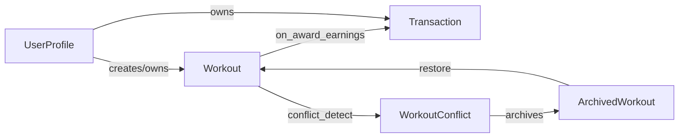

# Future Roadmap

Here is a list of features and fixes planned for the future development of Flexingg.

## Tasks

### PWA Work (deferred / future)

The following PWA-related items were intentionally deferred from the initial rollout and moved here. Once you are ready to provide the required assets, secrets, and approvals (see `Docs/pwa.md`), I can implement them in code.

- Push Notifications (deferred)
  - Tasks:
    - Generate VAPID keypair and provide values as environment variables (recommended names: `VAPID_PUBLIC_KEY`, `VAPID_PRIVATE_KEY`).
    - Server-side subscription endpoints: `POST /api/push/subscribe` and `DELETE /api/push/unsubscribe`.
    - Server push sender implementation (e.g., Django + pywebpush) and scheduled/triggered push workflows.
    - Client subscription UI and permission UX. Persist subscriptions to DB.
    - Acceptance criteria: successful subscription from an Android Chrome device, and ability to send a test notification from server.
  - Why deferred: requires sensitive keys and infra decisions; moved to roadmap until keys and policy are ready.

- Packaging & Store Distribution (deferred)
  - Tasks:
    - Prepare TWA using Bubblewrap or publishable PWABuilder package.
    - Provide store assets (screenshots, privacy policy URL, contact email).
    - Sign artifacts with your keystore (you keep signing keys private).
  - Why deferred: not shipping to Play/Store in this phase.

- Background Sync & Periodic Sync (deferred)
  - Tasks:
    - Implement Background Sync for queued writes (e.g., offline workout submissions).
    - Implement Periodic Background Sync for refreshing cached leaderboards where supported.
    - Provide fallbacks for unsupported browsers.
  - Why deferred: requires additional server-side idempotency and conflict-handling logic.

- Advanced integrations / enhancements
  - Badging API integration for unread counts (progressive enhancement).
  - Deeper offline snapshots for leaderboards/profile (pre-generated JSON).
  - CI Lighthouse automation for PWA checks.

See the main PWA plan for implementation details: [`Docs/pwa.md`](Docs/pwa.md:1). When you're ready to proceed with any of the deferred items, upload the required keys/assets or tell me which item to implement first and I will proceed with concrete code changes.


### Model Based Logic

Below are proposed model-level functions, properties, and managers derived from an audit of the models in [`Flexingg/core/models.py`](Flexingg/core/models.py:1). Each proposal includes a concrete method signature (parameters + return type), a short description, and a small example return payload or usage snippet. I also include a Mermaid diagram showing how the primary models interact at a high level.

Notes:
- Wherever I reference an existing class I make it clickable so you can jump straight to the implementation (e.g. [`UserProfile`](Flexingg/core/models.py:9), [`Workout`](Flexingg/core/models.py:441)).
- Signatures use simple Python typing hints appropriate for Django model methods.
- Example payloads are illustrative and intentionally small.

UserProfile (economy & XP)
- [`UserProfile`](Flexingg/core/models.py:9)

  - [`adjust_currency(currency: str, amount: Decimal, reason: str | None = None) -> dict`](Flexingg/core/models.py:9)  
    Description: Atomic helper to add/subtract currency for a user. Validates currency name (gym_gems/cardio_coins), creates a `Transaction` record, updates the model balance, and returns a summary. Uses DB transactions to ensure ledger integrity.  
    Example return:
    ```json
    {
      "status": "success",
      "currency": "gym_gems",
      "amount": "12.50",
      "balance": "102.50",
      "transaction_id": "uuid-..."
    }
    ```

  - [`transfer_currency(to_user: 'UserProfile', currency: str, amount: Decimal) -> dict`](Flexingg/core/models.py:9)  
    Description: Atomically transfer currency from this profile to another. Creates two `Transaction` rows (debit + credit), validates sufficient balance, and returns ledger summary.  
    Example return:
    ```json
    {
      "status": "success",
      "from": "alice",
      "to": "bob",
      "currency": "cardio_coins",
      "amount": "5.00"
    }
    ```

  - [`add_xp_and_level_up(xp: int, source: str | None = None) -> dict`](Flexingg/core/models.py:9)  
    Description: Add XP to the user, create the corresponding `Transaction` xp record, consult [`Level`](Flexingg/core/models.py:724) to determine if level(s) changed, apply level-up side effects (e.g., skill points placeholder), and return change summary.  
    Example return:
    ```json
    {
      "old_xp": 120,
      "new_xp": 320,
      "old_level": 2,
      "new_level": 3,
      "leveled_up": true,
      "xp_to_next": 180
    }
    ```

  - [`get_effective_multiplier(currency: str) -> Decimal`](Flexingg/core/models.py:9)  
    Description: Compute effective multiplier for earnings (combines personal multiplier and relevant stat-derived bonuses and temporary buffs).  
    Example return: `Decimal('1.15')`

  - [`latest_bodyweight() -> BodyWeight | Decimal`](Flexingg/core/models.py:9)  
    Description: Return the most recent `BodyWeight` row for the user if available, otherwise fallback to `bodyweight_lbs` field (Decimal).  
    Example return:
    ```json
    {
      "source": "healthconnect",
      "datetime": "2025-09-25T08:00:00Z",
      "weight_lbs": "195.25"
    }
    ```

  - Manager: `UserProfile.objects.active(within_days: int = 30) -> QuerySet[UserProfile]`  
    Description: Return users who have `last_sync` or `last_login` within the given window. Used by background jobs and retention/notification tasks.

Preferences & appearance
- [`ColorPreferences`](Flexingg/core/models.py:185)

  - [`as_theme_dict() -> dict`](Flexingg/core/models.py:185)  
    Description: Return a compact dict of all theme colors suitable for JSON APIs.  
    Example return:
    ```json
    {
      "surface": "#121212",
      "on_surface": "#FFFFFF",
      "primary": "#00f5d4"
    }
    ```

  - [`update_from_palette(palette: dict) -> dict`](Flexingg/core/models.py:185)  
    Description: Validate hex colors and update model fields in a single transaction. Returns updated fields.

Social / friendships
- [`Friendship`](Flexingg/core/models.py:240)

  - [`accept(actor: UserProfile | None = None) -> dict`](Flexingg/core/models.py:240)  
    Description: Set status to accepted, create reciprocal following/friendship records if necessary, and optionally notify users.  
    Example:
    ```json
    {"status": "accepted", "created_follow": true}
    ```

  - [`decline(actor: UserProfile | None = None, reason: str | None = None) -> dict`](Flexingg/core/models.py:240)

  - [`block(actor: UserProfile | None = None) -> dict`](Flexingg/core/models.py:240)  
    Description: Mark the friendship as blocked and ensure `UserProfile.blocking` / `blockers` reflect the change.

Gear / equipment
- [`Gear`](Flexingg/core/models.py:266)

  - [`rarity_score() -> int`](Flexingg/core/models.py:266)  
    Description: Translate `rarity` + stat bonuses into a sortable numeric score (used for shop ordering and drop mechanics).  
    Example: `42`

  - [`apply_to_profile(profile: UserProfile, equip: bool = True) -> dict`](Flexingg/core/models.py:266)  
    Description: Apply or remove gear bonuses to a profile's stats and record an equip/unequip audit. Returns a delta summary.

  - Manager: `Gear.objects.for_slot(slot: str) -> QuerySet[Gear]`

Transactions & accounting
- [`Transaction`](Flexingg/core/models.py:297)

  - [`@classmethod summary_for_user(cls, user: UserProfile, since: datetime | None = None) -> dict`](Flexingg/core/models.py:297)  
    Description: Aggregate totals and counts per currency_type for a user.  
    Example:
    ```json
    {"gym_gems": {"sum": "120.50", "count": 8}, "xp": {"sum": 300, "count": 3}}
    ```

  - [`balance_after(self) -> dict`](Flexingg/core/models.py:297)  
    Description: Optionally compute what the user's balance would be immediately after this transaction (useful for ledger snapshots). May be implemented lazily or by storing a `balance_snapshot` field.

  - Manager: `Transaction.objects.recent_for_user(user, limit: int = 50) -> QuerySet[Transaction]`

Sweat score and analytics
- [`SweatScoreWeights`](Flexingg/core/models.py:328)

  - [`@classmethod compute_sweat_score(cls, hr_zone_minutes: dict[int, int]) -> Decimal`](Flexingg/core/models.py:328)  
    Description: Given a mapping of zone -> minutes, compute a weighted sweat score using DB-configured weights.  
    Example:
    ```json
    {"sweat_score": "125.5"}
    ```

  - [`load_defaults() -> None`] Populate defaults during initial setup.

Connected services & sync
- [`ConnectedService`](Flexingg/core/models.py:409)

  - [`is_token_valid(self) -> bool`](Flexingg/core/models.py:409)
  - [`refresh_token(self) -> dict`](Flexingg/core/models.py:409)
  - [`get_auth_headers(self) -> dict`](Flexingg/core/models.py:409)

Data priority & conflict resolution
- [`DataPriority`](Flexingg/core/models.py:425)

  - Manager: `DataPriority.objects.for_user(user: UserProfile).ordered() -> dict[str, list[str]]`  
    Description: Return mapping of data_type -> ordered list of sources.
  - [`promote_source(self, data_type: str, source: str) -> dict`]

Workouts and reward pipeline
- [`Workout`](Flexingg/core/models.py:441)

  - [`get_total_volume(unit: str = "lb") -> float` (existing)](Flexingg/core/models.py:460) — keep and add helper:
    - [`get_total_volume_kg() -> float`]
  - [`is_conflicting_with(self, other: 'Workout') -> tuple[bool, float]`](Flexingg/core/models.py:441)  
    Description: Compare start/end windows and data similarity; return (conflict_found, conflict_score).  
    Example: `(true, 0.82)`

  - [`@classmethod from_source(cls, user: UserProfile, source: str, source_id: str, payload: dict, upsert: bool = True) -> tuple[Workout, bool]`](Flexingg/core/models.py:441)  
    Description: Idempotent get_or_create wrapper for ingesting source payloads. Returns (instance, created_flag).

  - [`award_earnings(self) -> dict`](Flexingg/core/models.py:441)  
    Description: Central reward computation calling `get_total_volume`, `SweatScoreWeights.compute_sweat_score`, `UserProfile.get_effective_multiplier`, then uses `UserProfile.adjust_currency` and `UserProfile.add_xp_and_level_up` to create transactions and award XP. Returns a summary:
    ```json
    {
      "gym_gems_awarded": "10.00",
      "cardio_coins_awarded": "4.50",
      "xp_awarded": 35
    }
    ```

- [`UnifiedWorkoutExercise`](Flexingg/core/models.py:520)

  - [`get_volume(self, unit: str = "lb") -> float`]
  - [`success_rate(self) -> float`]

- [`UnifiedWorkoutSet`](Flexingg/core/models.py:536)

  - [`completed_weight(self, unit: str = "lb") -> float`]
  - [`is_pr(self, comparator_queryset: QuerySet) -> bool`]

Conflicts & archiving
- [`ArchivedWorkout`](Flexingg/core/models.py:667)

  - [`restore_to_primary(self) -> dict`]  
    Description: Attempt to restore archived payload into `Workout` (idempotent), link to new primary, and record audit.

- [`WorkoutConflict`](Flexingg/core/models.py:694)

  - [`resolve_auto(self) -> dict`]  
    Description: Use `DataPriority` + `conflict_score` thresholds to resolve conflicts automatically (archive/merge/mark resolved) and write `resolved_at` + `resolution_method`. Returns details of actions taken.

Telemetry & other helpers
- [`Sleep`](Flexingg/core/models.py:565)
  - [`duration_seconds(self) -> int`]
  - [`compute_sleep_score(self) -> dict`]

- [`DailySteps`](Flexingg/core/models.py:584)
  - [`@classmethod upsert_for_date(cls, user, source, date, steps, data=None) -> tuple[DailySteps, bool]`]

- [`DailyWater`](Flexingg/core/models.py:604)
  - [`@classmethod add_intake(cls, user, source, date, ounces) -> Decimal`]

- [`NutritionEntry`](Flexingg/core/models.py:623)
  - [`macros_percent(self) -> dict`]

- [`BodyWeight`](Flexingg/core/models.py:648)
  - Manager: `BodyWeight.objects.latest_for_user(user: UserProfile) -> BodyWeight | None`

Leveling & XP helpers
- [`Level`](Flexingg/core/models.py:724)

  - [`@classmethod get_level_for_xp(cls, xp_total: int) -> tuple[Level, int]`]  
    Description: Return the Level row for the xp_total and xp_to_next. Example:
    ```json
    {"level": 3, "xp_to_next": 180}
    ```

  - [`next_level(self) -> tuple[Level | None, int | None]`]

Audit & bulk helpers
- `ModelAuditMixin` (applied to critical models)
  - [`log_change(self, actor: UserProfile | None, reason: str, payload: dict) -> None`]

- Bulk ingestion helpers:
  - `*.objects.bulk_upsert_from_source(payloads: list[dict]) -> dict` (workout/weights/steps) — return created/updated counts.

Mermaid diagram (model interactions)


Developer acceptance checklist (short)
- Unit tests for each method (happy / edge / failure cases).
- Idempotency for sync/upsert helpers.
- Database transactions around cross-row operations (currency transfer, restore).
- Audit logs for any automatic resolution or currency movement.
- Migrations documented where new fields are required.

Suggested immediate priorities (for implementation after review)
1. `UserProfile.adjust_currency`, `UserProfile.add_xp_and_level_up`, `Transaction.summary_for_user`  
2. `Workout.from_source`, `Workout.award_earnings`  
3. `WorkoutConflict.resolve_auto`, `ArchivedWorkout.restore_to_primary`  
4. ConnectedService token helpers and `Level.get_level_for_xp`  
5. Convenience `upsert` helpers for `DailySteps`, `DailyWater`, `BodyWeight`

End of proposed "Model Based Logic" section.
