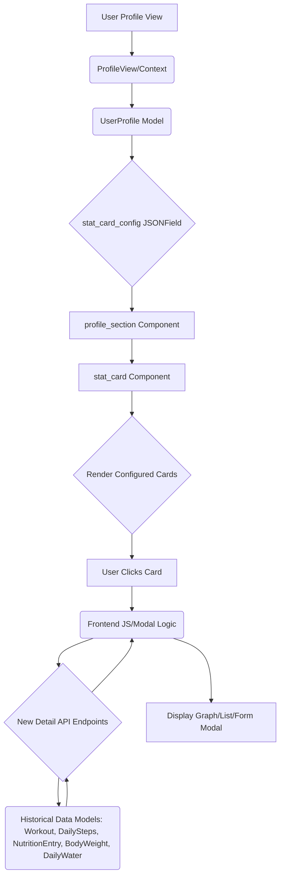

# Feature Plan: Configurable Profile Stat Cards & Detail Modals

## 1. Overview
This plan details the implementation of configurable daily stat cards (order and visibility) within the profile section, along with interactive pop-up modals for each card to display historical data (graphs) and detailed activity lists or manual entry forms.

The six stat cards to be managed are:
1.  `cardio_burned` (KCAL BURNED)
2.  `lifting_volume` (Total Volume)
3.  `steps` (STEPS TAKEN)
4.  `calories_consumed` (KCAL CONSUMED)
5.  `water_intake` (OZ INTAKE)
6.  `bodyweight` (CURRENT WEIGHT)

## 2. Data Model & Configuration (Backend)

We need a mechanism to store user preferences for stat card display.

### Required Model Change: `Flexingg/core/models.py`
Add a `JSONField` to `UserProfile` to store the configuration.

```python
# Flexingg/core/models.py (UserProfile)
# ... existing code ...
    lck_stat = models.IntegerField(default=0)
    level = models.IntegerField(default=1)
    xp = models.IntegerField(default=0)
    stat_card_config = models.JSONField(
        default=list,
        blank=True,
        help_text="Configuration for stat card order and visibility."
    )
# ... existing code ...
```

The default configuration will be a list of dictionaries, e.g., `[{'key': 'lifting_volume', 'visible': True, 'order': 1}, ...]`.

## 3. Backend API Implementation

We need new API endpoints to serve the detailed historical data required for the pop-up modals. These endpoints will accept a date range and return historical data points and activity lists.

| Stat Key | Endpoint/View | Data Required |
| :--- | :--- | :--- |
| `cardio_burned` | `CardioDetailAPIView` | Graph (daily calories burned), List (Workouts with type 'Cardio') |
| `lifting_volume` | `LiftingDetailAPIView` | Graph (daily total volume), List (Workouts with type 'Lifting') |
| `steps` | `StepsDetailAPIView` | Graph (daily steps) |
| `calories_consumed` | `NutritionDetailAPIView` | Graph (daily consumed calories), List (NutritionEntry) |
| `water_intake` | `WaterDetailAPIView` | Graph (DailyWater history), Manual Entry (DailyWater creation) |
| `bodyweight` | `BodyweightDetailAPIView` | Graph (BodyWeight history), Manual Entry (BodyWeight creation) |

We will add new URL patterns in `Flexingg/core/urls.py` and implement the corresponding views in `Flexingg/core/views.py`.

## 4. Frontend Component Integration

### `stat_card` Component (`Flexingg/core/components/stat_card/`)
1.  **`stat_card.py`**: Update `get_context_data` to accept the configuration list and filter/order the cards before rendering.
2.  **`template.html`**: Refactor the grid to dynamically render cards based on the configuration passed from the context. Add click handlers to each card to trigger the appropriate modal.
3.  **JavaScript**: Implement modal handling logic, including fetching data from the new API endpoints and rendering simple graphs (e.g., using Chart.js if available, or simple SVG/Canvas if not, but for planning, we assume a charting library or simple rendering). Implement manual entry forms for Water and Bodyweight.

### `profile_section` Component (`Flexingg/core/components/profile_section/`)
1.  **`profile_section.py`**: Fetch the `stat_card_config` from `UserProfile` and pass it to the `stat_card` component template tag.
2.  **`template.html`**: Ensure the `stat_card` component is rendered with the configuration.

### Configuration UI
A new configuration interface must be created to allow users to manage the `stat_card_config` field on their profile. This UI will be placed at the bottom of `Flexingg/core/templates/profile.html` and will utilize a live drag-and-drop interface (e.g., using SortableJS or similar library) to manage card order and visibility.

## 5. System Flow Diagram



## 6. Implementation Details & Decisions (Confirmed)

1.  **Configuration UI Location:** The configuration UI will be placed at the bottom of the main Profile page (`Flexingg/core/templates/profile.html`).
2.  **Default Order:** The default order will be maintained: Cardio, Lifting, Steps, Consumed Calories, Water, Bodyweight.
3.  **Interaction:** The configuration UI must use a live drag-and-drop interface for ordering.