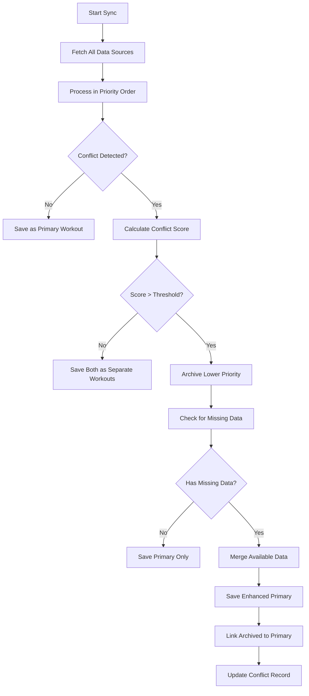

# Advanced Data Prioritization & Conflict Resolution System

## Current System Analysis

The current data prioritization system in `Flexingg/core/tasks.py` has a fundamental flaw: it processes data sources in priority order and uses `filled_dates` to prevent processing lower-priority data if higher-priority data exists for that date. This means:

- If Liftosaur (#1) syncs successfully, Garmin (#2) data gets completely skipped
- No conflict detection occurs
- No data merging or preservation happens
- Users lose potentially valuable data from lower-priority sources

## Proposed Solution

### 1. New Models for Conflict Tracking & Data Preservation

```python
class WorkoutConflict(models.Model):
    """Tracks conflicts between workout data from different sources"""
    id = models.UUIDField(primary_key=True, default=uuid.uuid4, editable=False)
    user = models.ForeignKey(UserProfile, on_delete=models.CASCADE, related_name='workout_conflicts')
    primary_workout = models.ForeignKey('core.Workout', on_delete=models.CASCADE, related_name='primary_conflicts')
    archived_workout = models.ForeignKey('core.ArchivedWorkout', on_delete=models.CASCADE, related_name='archived_conflicts')
    conflict_type = models.CharField(max_length=50, choices=[
        ('time_overlap', 'Time Overlap'),
        ('data_mismatch', 'Data Mismatch'),
        ('duplicate_activity', 'Duplicate Activity')
    ])
    conflict_score = models.FloatField(help_text="Confidence score of the conflict (0-1)")
    resolved_at = models.DateTimeField(null=True, blank=True)
    resolution_method = models.CharField(max_length=50, choices=[
        ('auto_priority', 'Automatic Priority'),
        ('manual_review', 'Manual Review'),
        ('data_merge', 'Data Merge')
    ], null=True, blank=True)
    created_at = models.DateTimeField(auto_now_add=True)

class ArchivedWorkout(models.Model):
    """Preserves workout data that was excluded due to conflicts"""
    id = models.UUIDField(primary_key=True, default=uuid.uuid4, editable=False)
    user = models.ForeignKey(UserProfile, on_delete=models.CASCADE, related_name='archived_workouts')
    source = models.CharField(max_length=50)
    source_id = models.CharField(max_length=255)
    start_time = models.DateTimeField()
    end_time = models.DateTimeField()
    duration_seconds = models.FloatField(null=True, blank=True)
    data = models.JSONField(help_text="Original workout data before archiving")
    archived_reason = models.CharField(max_length=100, choices=[
        ('lower_priority', 'Lower Priority Source'),
        ('time_conflict', 'Time Conflict'),
        ('data_conflict', 'Data Conflict')
    ])
    archived_at = models.DateTimeField(auto_now_add=True)
    linked_primary_workout = models.ForeignKey('core.Workout', on_delete=models.SET_NULL, null=True, blank=True, related_name='linked_archived_workouts')
```

### 2. Conflict Detection Algorithms

#### Time-Based Conflicts
- **Same Day Different Values**: Different step counts for the same date
- **Workout Time Overlap**: Strength workouts starting within 30 minutes of each other
- **Activity Type Conflicts**: Multiple cardio activities claiming to be the same workout

#### Data Quality Conflicts
- **Missing Data**: Primary source missing heart rate, secondary has it
- **Data Inconsistency**: Significantly different values (e.g., 10K steps vs 20K steps)
- **Source Reliability**: Historical accuracy of each data source

### 3. Conflict Resolution Priority Matrix

| Conflict Type | Primary Source | Secondary Source | Resolution Strategy |
|---------------|----------------|------------------|-------------------|
| Time Overlap | Liftosaur | Garmin | Prefer Liftosaur, archive Garmin |
| Missing HR Data | Liftosaur | Garmin | Merge HR data from Garmin |
| Step Count Mismatch | Garmin | Health Connect | Prefer Garmin, archive Health Connect |
| Duplicate Activities | Any | Any | Archive duplicate, merge unique data |

### 4. Data Merging Capabilities

#### Heart Rate Data
- Extract HR zones from Garmin activities
- Apply to Liftosaur workouts missing HR data
- Calculate average/max HR for the workout duration

#### GPS/Location Data
- Add route information from Garmin to Liftosaur workouts
- Include elevation data where available

#### Environmental Data
- Temperature, humidity from weather APIs
- Indoor vs outdoor classification

### 5. Updated Sync Process Flow



### 6. Implementation Phases

#### Phase 1: Core Infrastructure
- Add new models for conflict tracking and archived workouts
- Create conflict detection utilities
- Update sync process to detect conflicts instead of skipping

#### Phase 2: Data Merging Engine
- Implement data merging algorithms for different data types
- Add support for filling missing data from archived workouts
- Create validation for merged data integrity

#### Phase 3: User Interface
- Add conflict resolution dashboard
- Manual review capabilities for high-confidence conflicts
- Data comparison tools for users

## Migration Strategy

All migrations will be done by the user at the end.

1. **Phase 1**: Deploy new models and basic conflict detection
2. **Phase 2**: Enable data merging for existing archived data
3. **Phase 3**: Add manual review interface
4. **Phase 4**: Implement advanced features based on user feedback

This plan transforms the current "skip lower priority" approach into a sophisticated conflict resolution system that preserves data value while respecting user priorities.